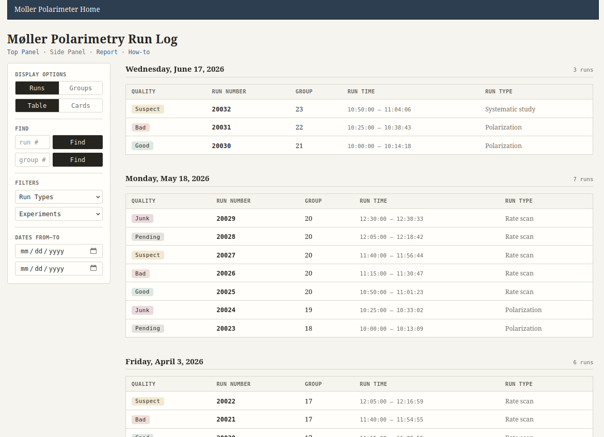
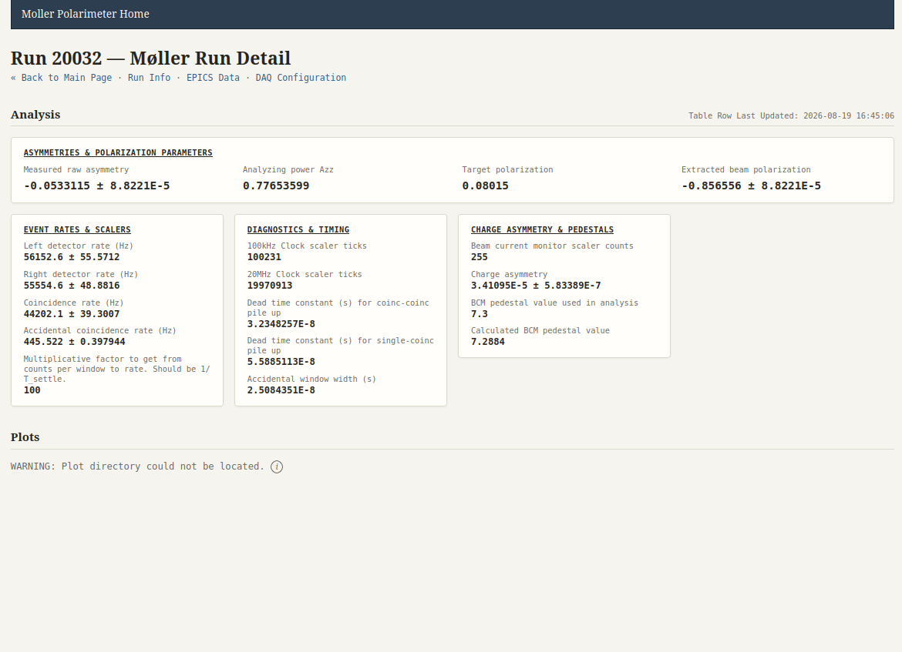
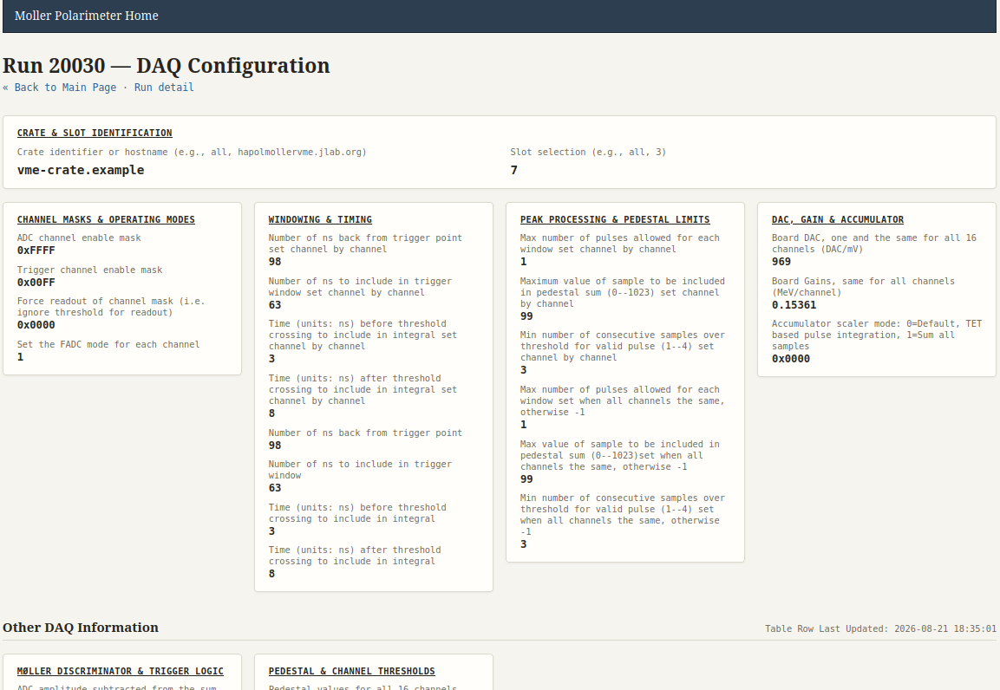
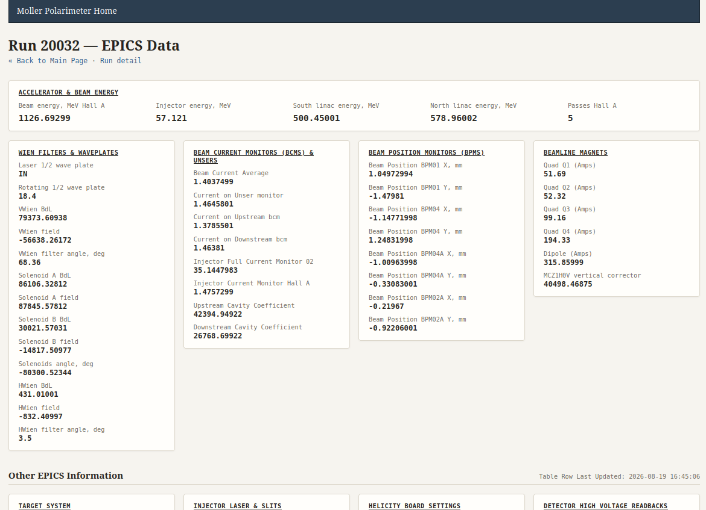
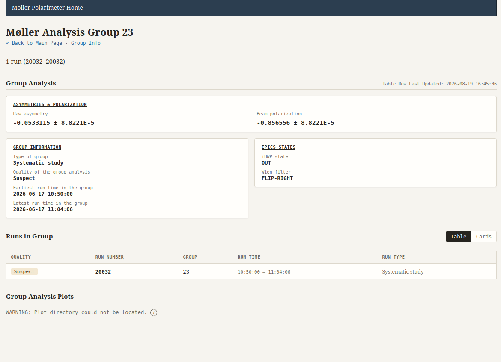
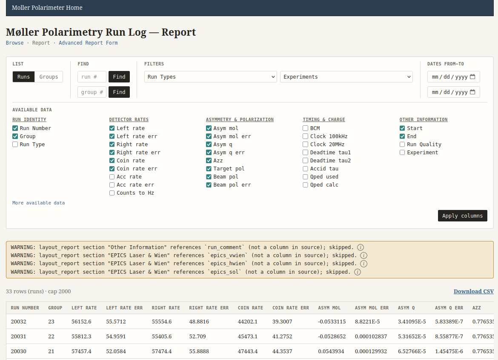

# Møller Polarimetry Run Log

Read-only PHP dashboard over a MariaDB run-log / DAQ database for the
**Møller polarimeter** (not the MOLLER experiment).

The live schema is owned elsewhere; this site only **reads** it. New
columns with useful `COLUMN_COMMENT`s appear without a PHP change.
What shows where (cards, tables, detail sections) is maintained under
`includes/layouts/`.

**Stack:** PHP 5.4 (production target; Docker tests on 5.4.45), plain (no framework), PDO prepared statements,
`assets/style.css`, minimal `assets/site.js` (filter autosubmit +
advanced column picker) so CSP can use `script-src 'self'`.
Run Info / Group Info are CSS `:target` modals — no JS framework or
build step.

---

## Preview

Screenshots from the local Docker UI (same layout as production).
Displayed at **720px** wide so they fit a GitHub README column.
Generated seed junk data for testing database shown (not actual data). 

### Browse (index)



### Run detail



### DAQ config



### EPICS



### Group detail



### Report



---

## Data model

| Table | Key | Role |
|-------|-----|------|
| `Run_info` | `run_number` | Parent run record |
| `DAQ_config` | `run_number` | Per-run DAQ settings |
| `EPICS_data` | `run_number` | Per-run EPICS snapshot |
| `Analysis` | `run_number` | Per-run (prompt) analysis |
| `Grouped_Analysis` | `group_number` | Group / final analysis |

`Run_info.run_group` links a run to a group. Plots live on disk under
`{plots_base}/{run_number}/` or `{plots_base}/{group_number}/`.

Type and quality are **codes** (`POLARIZATION`, `GOOD`, …) with English
labels in `run_type_lookup` / `run_quality_lookup`. The site never
hardcodes those labels. `PENDING` is unset quality; `MIXED` is a **type**
(for groups with mixed member types).

---

## Pages

| Page | Role |
|------|------|
| `index.php` | Run/group list (table or cards; top or side filters) |
| `report.php` | Simple filtered report + CSV |
| `report_advanced.php` | Same report with Available \| Selected column picker + CSV |
| `detail_runs.php` | Analysis + plots; Run Info modal |
| `detail_epics.php` | EPICS_data |
| `detail_daq.php` | DAQ_config (canonical thin detail template) |
| `detail_groups.php` | Grouped_Analysis + member runs + plots; Group Info modal |
| `help_howto.php` | Caretaker how-to (schema + layouts) |
| `help_errors.php` | Status-message help catalog |

Shared includes: `bootstrap.php`, `schema.php`, `render_helpers.php`
(barrel for `helpers_*.php`), `index_*` / `report_*`, and
`includes/layouts/`.

---

## Layout-driven maintenance

For routine “what shows where” work, edit **`includes/layouts/`** only —
not page PHP, other `includes/*.php`, or CSS (unless you need a class
already in the design system). Layout file headers are the instructions.
No DB credentials in layouts. Prefer `'link' => 'run'|'group'` over raw
URLs; the exception is `layout_navbar.php` (site-wide hrefs).

| File | Controls |
|------|----------|
| `layout_navbar.php` | Optional master top bar (`links`). Empty → hidden. Colors: `--site-nav-*` in CSS. |
| `layout_cards.php` | Index / member **cards** |
| `layout_tables.php` | Index / member **tables** |
| `layout_report.php` | Report column catalog + defaults |
| `layout_run_summary.php` | Run Info / Group Info modal rows |
| `layout_lookups.php` | Column → lookup table; quality code → CSS slug |
| `layout_sections.php` | Detail classifiers, `exclude`, featured rows, card bands |

Unmatched columns still appear under **Unallocated Sections** (never
silently drop). Section titles in `featured` / `layouts` must match
classifier `section` strings exactly.

Non-layout knobs: `includes/config.php` (title, index defaults, plot
paths, `row_cap`, `report_row_cap`).

### What to edit for what

| Goal | Where |
|------|--------|
| Card / table / modal / detail grouping | `includes/layouts/` |
| Site title, index defaults, plot paths | `includes/config.php` |
| Help text for ⓘ | `includes/descriptions_errors.php` |
| Live DB connection | `./tools/init_site.sh` (git-ignored `*.local.php`) |
| CSS | `assets/style.css` |
| Filter autosubmit / column picker JS | `assets/site.js` |
| Page titles / empty-copy strings | `Page copy` block atop each detail page |

---

## Schema assumptions

The site reads `INFORMATION_SCHEMA` every request. **Adding** a commented
column is the happy path. Unmatched columns land in **Other** /
**Unallocated Sections**.

**Comments are load-bearing** — there is no second copy of those labels
in PHP.

**Identity** (renames break joins / pages): the tables above; PKs
`run_number`, `group_number`; membership `Run_info.run_group`.

**Expected on list pages** (missing → warn, keep going): `run_type` /
`group_type`, `run_experiment`, `run_start_datetime` / `group_start`.

On detail cards, `foo` + `foo_err` render as one `value ± error` row.
A new table still needs a page (or a `section_view_table_map()` entry) —
introspection does not invent pages.

In-app status help: `help_errors.php` and caretaker docs in
`help_howto.php`. Catalog: `includes/descriptions_errors.php`.

---

## Local testing

`docker/` is a **test-only** MariaDB + Apache/PHP stack with
`seed_junk_data.php`. Not how production runs — see `docker/README.md`.

```bash
php tests/run.php                                 # pure helpers (no Docker)
./tests/smoke.sh http://127.0.0.1:8090            # HTTP status + no leaked fatals
./tests/schema_drift.sh http://127.0.0.1:8090     # ALTER degrade checks (+ reseed)
```

Default smoke/drift fixtures: run **20000**, group **1**. Override with
`SMOKE_RUN` / `SMOKE_GROUP`. Session notes: `tests/MANUAL.md`.

### Scale snapshot (local Docker, 2026-08-21)

One-off timing with **20 000** runs (+ **10 000** groups) against
`http://127.0.0.1:8090`. Caps unchanged (`row_cap` 300,
`report_row_cap` 2000). Warm once, five `curl` samples → **median**
wall time. DB restored to the normal ~30-run seed afterward (no
load-test script in the tree).

| URL | Median s | Body (approx) |
|-----|---------:|--------------:|
| `/index.php` | 0.013 | 138 k |
| `/index.php?view=groups` | 0.014 | 106 k |
| `/index.php?layout=cards` | 0.013 | 123 k |
| `/index.php?type=POLARIZATION` | 0.014 | 143 k |
| `/index.php?from=2025-01-01&to=2025-06-30` | 0.021 | 138 k |
| `/report.php` | 0.038 | 1.3 M |
| `/report.php?view=groups` | 0.027 | 839 k |
| `/report.php?format=csv` | 0.026 | 174 k |
| `/report_advanced.php` | 0.036 | 1.4 M |
| `/detail_runs.php?run=20000` | 0.003 | 4 k |
| `/detail_daq.php?run=20000` | 0.002 | 5 k |
| `/detail_epics.php?run=20000` | 0.003 | 10 k |
| `/detail_groups.php?group=1` | 0.011 | 5 k |
| `/help_howto.php` | 0.001 | 42 k |

On that laptop Docker path, capped browse/report stayed under ~50 ms at
20 k runs. Re-check if production row counts or joins differ a lot. The 
reality is that we'll never pull 20,000 runs of data or even 2,000 runs 
in a run report; I just wanted to make sure that there wasn't something 
funky about the behavior. 

---

## Deploy / setup

Single web server: PHP with PDO MySQL + the MariaDB this site reads.
No build step.

**Ship only the site, not the repo.** Assume an unhardened host that may
ignore `.htaccess` and enable directory listings. Do not clone into the
web directory — export from a clean commit:

```bash
./tools/production_export.sh /path/to/webdir              # dry run
./tools/production_export.sh /path/to/webdir --apply
./tools/production_export.sh /path/to/webdir --apply --prune
./tools/production_export.sh /path/to/webdir --apply --url https://SITE
```

Allowlist is `SITE_PATHS` in that script (pages, `assets/`, `includes/`,
`.htaccess`, `tools/init_site.sh`). Docs, Docker, tests, and Cursor
rules stay out. Credentials `includes/dbconnect-*.local.php` are never
in git and never deleted by export. After overwriting `bootstrap.php`,
re-run `./tools/init_site.sh --relink` in the web directory.

**First-time DB wiring** on the server (from site root):

```bash
./tools/init_site.sh
```

Copies `includes/dbconnect-template.php` → a git-ignored
`dbconnect-<random>.local.php` and points `bootstrap.php` at it. Use a
**SELECT-only** account. Prefer **`127.0.0.1`** over `localhost` when
connecting via TCP (PHP’s MySQL driver treats `localhost` as a Unix
socket). Docker testing uses `SITE_DB_*` and does not need this script.

**Plots:** set `run_plots_web_base` / `group_plots_web_base` (and
`*_plots_fs_base` if needed) in `includes/config.php`.
